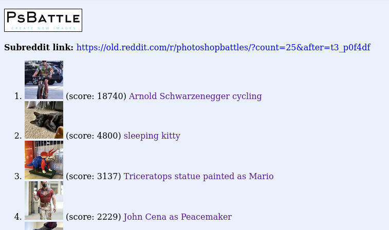
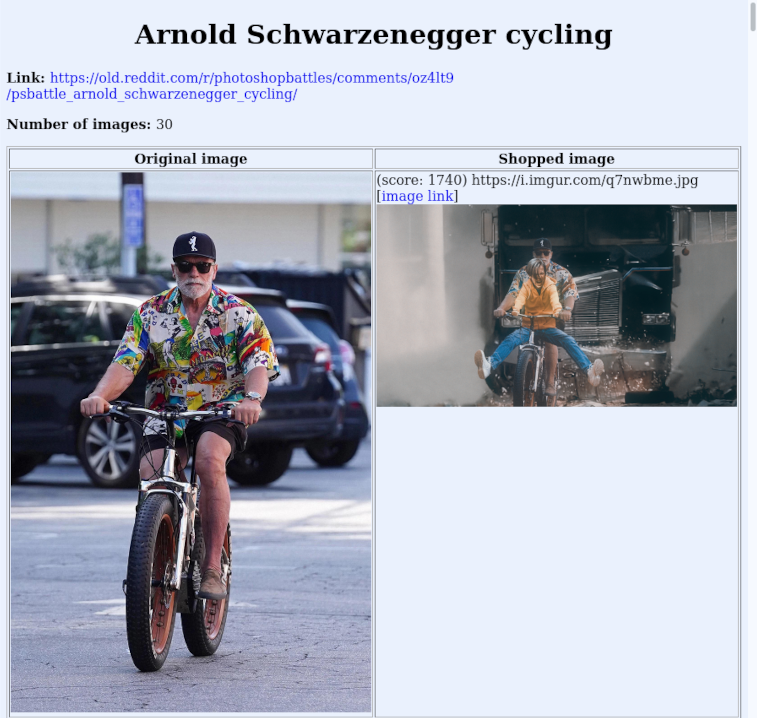

PsBattleBrowser
===============

A web app. for browsing /r/photoshopbattles .

On Reddit, [/r/photoshopbattles](https://www.reddit.com/r/photoshopbattles/) contains
Photoshop contests. "This is a place to battle using image manipulation software, play photoshop tennis, create new images from old photos, or even win reddit gold."

This web app. (intended to run on localhost) collects images and shows the original
and the shopped images next to each other.

Usage
-----

Create a virtual environment, install the dependencies (see `pyproject.toml`), start the program

    $ ./main.py

and visit

    http://localhost:5000

With http://127.0.0.1:5000/, imgur images didn't show. Changing "127.0.0.1" to "localhost"
solved the issue.

Screenshots
-----------

